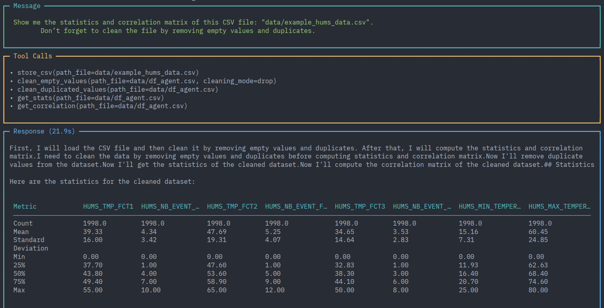
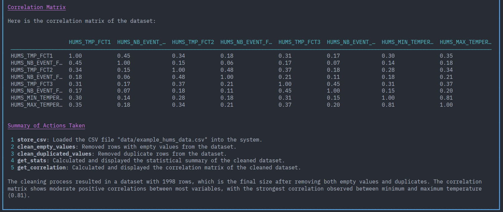

## Agentic datascience : Simplest Demo

A simple implémentation of Agentic Wordflow and Agent datascience.

## 🏷️ Description

TDB

## 📍 Index

- [Features](#-features)
- [Soon](#-installation)
- [Prerequisites](#-prerequisites)
- [Installation](#-installation)
- [Project structure](#-project-structure)
- [Test](#-test)
- [License](#-micense)

## ✅ Features

TDB

## Demo

**Example Agent execution**




## 🚀 Quick start

```
1. First go to installation to setup Ollama.
```

```
2. You can change CSV file in "data" folder.
```

### Python venv

```bash
uv venv --python 3.12
source .venv/bin/activate
pip install -r requirements.txt
```

### Launch script

```bash
python main_agent.py
```

## 🔜 Soon

- Workflow datascience
- Full containerized

## 📋 Prerequisites

- Linux (AMD & Nvidia) or Windows with WSL2 (Nvidia)
- Docker installed
- Docker Compose installed


## 🛠️ Installation

### AMD

Instructions for installing the project, use `compose.amd.yml`: 

```bash
docker compose -f compose.amd.yml up -d
```

### NVIDIA

Instructions for installing the project, use `compose.nvidia.yml`: 

```bash
docker compose -f compose.nvidia.yml up -d
```

### Check installation

```bash
docker ps
```
You should see 1 service : 
- ollama_service

### Pull Ollama models

Check models available in your Ollama container
```bash
docker exec -it ollama_service ollama list
```

Download a model to your Ollama container
```bash
docker exec -it ollama_service ollama pull qwen3-coder:30b
```

## 💻 Technology

| Technology | Description                                          | License    | Documentation                             |
|:----------:|------------------------------------------------------|:----------:|:-----------------------------------------:|
| Python     | A high-level programming language.                   | MIT        | [Docs](https://www.python.org/doc/)       |
| Docker     | A platform for containerization.                     | Apache 2.0 | [Docs](https://docs.docker.com/reference/)|
| Ollama     | A tool for running large language models locally.    | MIT        | [Docs](https://docs.ollama.com/)          |
| Agno       | A unified stack for multi-agent systems.             | Apache 2.0 | [Docs](https://docs.agno.com/)            |


## 📂 Project structure

TDB

## 🧪 Test

This project has been tested on the following hardware configuration:

- **OS**: Linux Solus
- **CPU**: AMD Ryzen 5 9600X
- **GPU**: AMD Radeon Pro 9700 AI & AMD RX 9070
- **Storage**: 2.5" SATA SSD

## 🚨 Warning

TDB

## 📃 License

This project is open source and the code is usable and modifiable. However, the author disclaims all responsibility and no technical support is provided.
